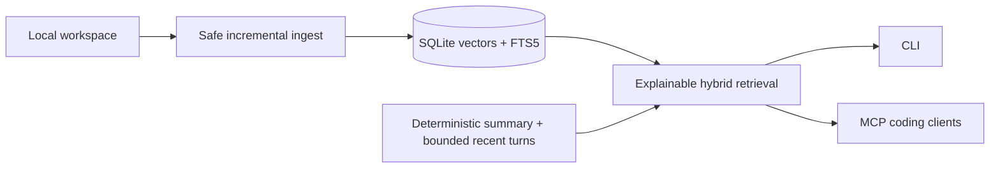

# Kinekt

<p align="center">
  
</p>

Kinekt is an explainable, local-first context engine for agentic coding.

It helps coding agents understand your project without sending your source code to a required cloud service. You point Kinekt at a workspace, it indexes local code and markdown notes, then exposes that context through a CLI and a Model Context Protocol (MCP) server.

Kinekt is not the agent. It is the context layer that agents use.

## Proof, Not Promises

Kinekt includes versioned retrieval evaluations and CI quality gates. On the deterministic Docker baseline,
hybrid retrieval improved the ten-question Kinekt dataset as follows:

| Retrieval iteration | Recall@5 | MRR | nDCG@5 | Mean query latency |
| --- | ---: | ---: | ---: | ---: |
| Initial vector + lexical boost | 0.55 | 0.252 | 0.351 | 45.2 ms |
| FTS5 hybrid + bounded broad-pool reranking | **0.90** | **0.600** | **0.691** | **94.4 ms** |

The separate pinned external corpus contains twelve coding questions across Requests (Python), chi (Go), and
serde_json (Rust):

| External corpus | Recall@5 | MRR | nDCG@5 | Mean query latency |
| --- | ---: | ---: | ---: | ---: |
| 3 repositories / 12 cases | **0.958** | **0.917** | **0.918** | **64.5 ms** |

Reproduce both gates with `python scripts/check_retrieval_eval.py` and
`python scripts/check_external_retrieval_eval.py`. The external test clones exact public commit SHAs, and the
corpus is intentionally reported as a small curated benchmark rather than proof of universal retrieval quality.
See [Retrieval evaluation](docs/retrieval-evaluation.md) for methodology, per-repository results, thresholds, and
known gaps.



Kinekt uses standard stdio MCP and provides setup examples for Claude Desktop, Codex, Gemini CLI, and local
Ollama-wrapper clients. Automated SDK discovery and MCP Inspector validation pass, and Codex's Docker server
configuration parses without modifying user config. Live Claude Desktop and Gemini CLI calls remain manual evidence
items. Ollama itself is a local model runtime, so direct Ollama MCP usage requires an MCP-aware client or wrapper.

## The Problem

Developers keep important context in too many places:

- Source files and architecture modules
- Local markdown notes, Obsidian vaults, and exported docs
- Git branch state and uncommitted changes
- Previous agent or chat sessions

Coding agents are useful, but they often lose project context between turns or only see the files pasted into the prompt. That leads to repeated explanations, missed constraints, and weaker code suggestions.

## How Kinekt Helps

Kinekt turns local project context into a queryable developer memory layer:

1. `kinekt attach` detects the repository opened in the current terminal, shows its canonical root and git branch,
   and requires user confirmation before recording the attachment.
2. `kinekt init` creates a workspace-local SQLite database under `.kinekt/kinekt.sqlite3`.
3. `kinekt ingest <workspace>` scans code and markdown, chunks files, hashes content, skips unchanged files,
   and prunes deleted or newly ignored files from the index.
4. Kinekt stores searchable chunks in local SQLite by default, with optional local ChromaDB support.
5. `kinekt query "<question>"` retrieves relevant indexed context.
6. `kinekt agent-setup <client>` renders a native or Docker-backed MCP configuration without modifying the
   client's settings.
7. `kinekt mcp-serve --allow-workspace <workspace>` exposes safe tools to MCP clients within explicitly
   allowed workspace roots:
   - `workspace_status`
   - `query_knowledge_base`
   - `get_git_context`
   - `read_workspace_file`
   - `session_start`
   - `session_history`
   - `agent_turn`

The default path has no mandatory cloud dependency. Optional Ollama support can provide local embeddings and local generation when the user installs and starts Ollama separately.

## Status

Kinekt is in active public-beta hardening. It is useful for local testing and agent integration experiments, but it is not yet an enterprise-stable product.

Current beta priorities:

- Local-first behavior by default
- Read-only workspace and git safety boundaries unless a user explicitly acts outside Kinekt
- Python 3.11 through Python 3.14 support
- Cross-platform CLI and test coverage on Windows, macOS, and Linux
- Stdio MCP server support for agent integrations

## Install

Kinekt supports Python 3.11 through Python 3.14.

For local development from a clone:

```bash
uv sync --locked --python 3.11 --extra dev --extra mcp
```

The committed `uv.lock` resolves Python 3.11 through 3.14 across Linux, macOS, and Windows. A direct editable pip
install remains available for contributors who are not using uv: `python -m pip install -e ".[dev,mcp]"`.

For a direct GitHub install during beta:

```bash
python -m pip install "kinekt[mcp] @ git+https://github.com/rubenatello/kinekt.git"
```

Optional ChromaDB vector backend:

```bash
python -m pip install -e ".[vector]"
```

Optional local Ollama support is user-managed. Kinekt does not install Ollama or pull models automatically.

## Quickstart

Open the target repository in VS Code, PyCharm, another editor, or a terminal. Kinekt detects the nearest Git or
recognized project root, prints the exact path and branch, and asks for confirmation:

```bash
kinekt attach
```

Attach and index in one step:

```bash
kinekt attach --ingest
```

Confirm what Kinekt attached, then ask a local context question from any nested project directory:

```bash
kinekt workspace-status
kinekt query "where is session history stored?" --limit 5
```

Show local runtime diagnostics:

```bash
kinekt doctor
```

Generate an MCP configuration for Codex, Claude Desktop, Gemini CLI, or a generic stdio client:

```bash
kinekt agent-setup codex
kinekt agent-setup claude
kinekt agent-setup gemini
```

`agent-setup` prints configuration and never changes client files. See
[Workspace detection and agent setup](docs/workspace-attachment.md) for native, Docker-first, editor, and client
walkthroughs, or [MCP client setup](docs/mcp-clients.md) for reference configurations.

For more detail on agent integration and where data is stored, see:

- [Agent connections](docs/agent-connections.md)
- [Workspace detection and agent setup](docs/workspace-attachment.md)
- [Implemented architecture](docs/architecture.md)
- [Engineering case study](docs/engineering-case-study.md)
- [External repository case study](docs/external-repository-case-study.md)
- [Two-minute terminal demo](docs/demo.md)
- [MCP client validation](docs/client-validation.md)
- [Release process](docs/release-process.md)
- [Implementation plan](docs/implementation-plan.md)
- [Retrieval evaluation](docs/retrieval-evaluation.md)
- [Game-changer roadmap](docs/gamechanger-roadmap.md)
- [Storage, hosting, and sync](docs/storage-and-sync.md)
- [Test Kinekt on another project](docs/test-another-project.md)

## CLI Usage

Detect and explicitly confirm the repository opened in the current editor terminal:

```bash
kinekt attach
kinekt workspace-status
```

For automation, confirmation must be explicit. `--ingest` initializes and scans immediately:

```bash
kinekt attach --yes --ingest --json
```

Generate a client configuration using either the native executable or the Docker image:

```bash
kinekt agent-setup codex
kinekt agent-setup codex --docker
```

When no workspace argument is supplied, CLI commands detect the nearest Git or recognized project root. An
explicit workspace path still wins, and `KINEKT_WORKSPACE` can supply the starting path for editor tasks.

Read git status context:

```bash
kinekt git-context /path/to/repo
```

Read a workspace file safely:

```bash
kinekt read-file src/main.py --workspace /path/to/workspace --max-chars 2000
```

`read-file` blocks path traversal outside the declared workspace. `--max-chars` is clamped to `1..50000`.

Inspect the persisted index configuration and row counts:

```bash
kinekt index-status /path/to/workspace
```

Force a clean rebuild after intentionally changing chunking or embedding configuration:

```bash
kinekt reindex /path/to/workspace
```

Run a versioned retrieval evaluation against an indexed workspace:

```bash
kinekt eval evals/kinekt-retrieval.eval.json --workspace /path/to/workspace --limit 5
```

Explain why each query result ranked where it did:

```bash
kinekt query "where is workspace authorization enforced?" \
  --workspace /path/to/workspace --limit 5 --explain
```

Start or reuse a session:

```bash
kinekt session-start --workspace /path/to/workspace
```

Run a stateful local agent turn:

```bash
kinekt agent-turn "how does ingestion work?" --workspace /path/to/workspace --session-id <session-id>
```

Inspect session history:

```bash
kinekt session-history <session-id> --workspace /path/to/workspace --limit 30
```

Limits are clamped for safety:

- `query --limit`: `1..20`
- `session-history --limit`: `1..100`
- `agent-turn --query-limit`: `1..10`
- `agent-turn --history-window`: `1..20`

## Optional Local AI

Kinekt defaults to deterministic local fallbacks, so it works without Ollama.

To use Ollama for local embeddings:

```bash
export KINEKT_EMBEDDING_BACKEND=ollama
export KINEKT_OLLAMA_URL=http://127.0.0.1:11434/api/embeddings
export KINEKT_OLLAMA_MODEL=nomic-embed-text
export KINEKT_OLLAMA_TIMEOUT_SECONDS=10
```

To use Ollama for local generation in `agent-turn`:

```bash
export KINEKT_GENERATION_BACKEND=ollama
export KINEKT_OLLAMA_GENERATE_URL=http://127.0.0.1:11434/api/generate
export KINEKT_OLLAMA_GENERATE_MODEL=llama3.1:8b
export KINEKT_OLLAMA_GENERATE_TIMEOUT_SECONDS=20
```

Then validate your setup:

```bash
kinekt doctor /path/to/workspace
```

Safety behavior:

- Non-loopback Ollama endpoints are rejected.
- Embedding backend failures stop indexing/querying with an actionable error so persisted vectors cannot mix
  providers or dimensions. Select `KINEKT_EMBEDDING_BACKEND=deterministic` explicitly when Ollama is unavailable.
- Generation failures may fall back to deterministic local output because they do not mutate the persisted index.
- Kinekt reports setup guidance but does not install Ollama, start services, or pull models automatically.

## Optional Vector Backend

Kinekt defaults to SQLite-backed local vector search.

To request local ChromaDB storage:

```bash
export KINEKT_VECTOR_BACKEND=chromadb
```

If ChromaDB is requested but unavailable, Kinekt fails with setup guidance instead of silently querying a
different or empty backend. Change back to `sqlite_local` and run `kinekt reindex`, or install `kinekt[vector]`.
Kinekt uses Chroma's embedded `PersistentClient`; it does not start or expose a Chroma network server. Review the
[security policy](SECURITY.md#optional-chromadb-boundary) before using the optional package in a shared environment.

## Docker

Build the image:

```bash
docker build -t kinekt:local .
```

The production image includes MCP support and git, installs Kinekt from a wheel, and runs as a non-root user.

Run commands against a mounted workspace:

```bash
docker run --rm -it -v /path/to/workspace:/workspace kinekt:local init /workspace
docker run --rm -it -v /path/to/workspace:/workspace kinekt:local ingest /workspace
docker run --rm -it -v /path/to/workspace:/workspace kinekt:local query "where is context stored?" --workspace /workspace
```

Recommended first-time Docker attachment uses an explicit host-path alias so confirmation remains recognizable on
both sides of the bind mount:

```powershell
$workspace = "C:\Projects\target-repo"
docker run --rm -it `
  --env "KINEKT_WORKSPACE_ROOT_ALIAS=$workspace" `
  --mount "type=bind,source=$workspace,target=/workspace" `
  kinekt:local attach /workspace --ingest
```

Generate a Docker-backed Codex configuration from the container:

```powershell
docker run --rm `
  --env "KINEKT_WORKSPACE_ROOT_ALIAS=$workspace" `
  --mount "type=bind,source=$workspace,target=/workspace" `
  kinekt:local agent-setup codex /workspace --docker --mount-source "$workspace"
```

The complete Docker-first flow is in [Workspace detection and agent setup](docs/workspace-attachment.md).

On Linux, build with your host UID/GID so bind-mounted files keep the expected ownership:

```bash
docker build \
  --build-arg KINEKT_UID="$(id -u)" \
  --build-arg KINEKT_GID="$(id -g)" \
  -t kinekt:local .
```

Compose provides the same workflow. Set `KINEKT_WORKSPACE` to the project you want to inspect:

```bash
KINEKT_WORKSPACE=/path/to/workspace docker compose run --rm kinekt attach /workspace --ingest
KINEKT_WORKSPACE=/path/to/workspace docker compose run --rm kinekt init /workspace
KINEKT_WORKSPACE=/path/to/workspace docker compose run --rm kinekt ingest /workspace
KINEKT_WORKSPACE=/path/to/workspace docker compose run --rm kinekt query "where is context stored?" --workspace /workspace
```

Run the clean container test target:

```bash
docker build --target test -t kinekt:test .
docker run --rm kinekt:test
```

To smoke test another supported Python line:

```bash
docker build --build-arg PYTHON_VERSION=3.14 -t kinekt:py314 .
docker run --rm kinekt:py314 --help
```

## Development

Install development dependencies:

```bash
uv sync --locked --python 3.11 --extra dev --extra mcp
```

Run tests:

```bash
uv run --locked python -m pytest -q
```

Enforce deterministic retrieval-quality thresholds:

```bash
uv run --locked python scripts/check_retrieval_eval.py
uv run --locked python scripts/check_external_retrieval_eval.py
```

Validate packaging from a clean wheel install:

```bash
python scripts/check_package.py
```

Validate every supported Python version installed locally:

```bash
python scripts/test_python_versions.py
```

The version script tests Python 3.11, 3.12, 3.13, and 3.14 when those interpreters are available, and skips versions that are not installed locally.

## CI

GitHub Actions workflows are included for:

- Locked Python tests on Ubuntu, Windows, and macOS for Python 3.11 through 3.14
- Docker image build and smoke tests on Python 3.11 and 3.14
- Linting, static typing, coverage, dependency auditing, and dependency-review policy
- Package build, metadata, wheel install, CLI smoke validation, SBOM generation, and tagged artifact provenance
- Scheduled real ChromaDB, Ollama HTTP-contract, MCP Inspector, and pinned external-repository evidence

## Logging And Errors

Kinekt emits structured JSON logs on stderr for CLI and MCP command/tool events.

- Set log level with `KINEKT_LOG_LEVEL`, for example `INFO`, `WARNING`, or `ERROR`.
- CLI failures are normalized to JSON error payloads: `{"code": "...", "message": "..."}`.
- MCP tool failures use the same error shape: `{"code": "...", "message": "..."}`.

## Public Beta Limitations

- MCP server transport is stdio-only.
- Ollama is optional and user-managed.
- Deterministic local embeddings/generation are fallbacks, not a replacement for high-quality semantic models.
- Live Claude Desktop and Gemini CLI validation still requires those clients on a maintainer workstation.
- MCP access is restricted to the server working directory by default; configure additional roots with repeatable
  `--allow-workspace` arguments or `KINEKT_ALLOWED_WORKSPACES` using the platform path separator.
- Kinekt intentionally avoids automatic git writes, commits, pushes, and source-control mutations.
- Repository detection is command-driven rather than a background editor watcher; attachment always requires a
  user confirmation or explicit `--yes`.
