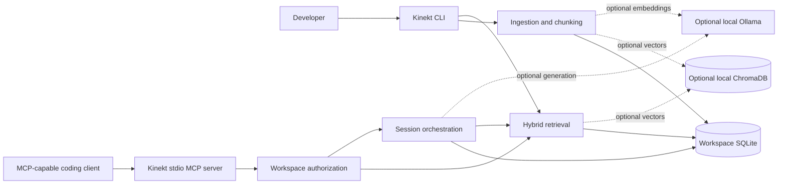
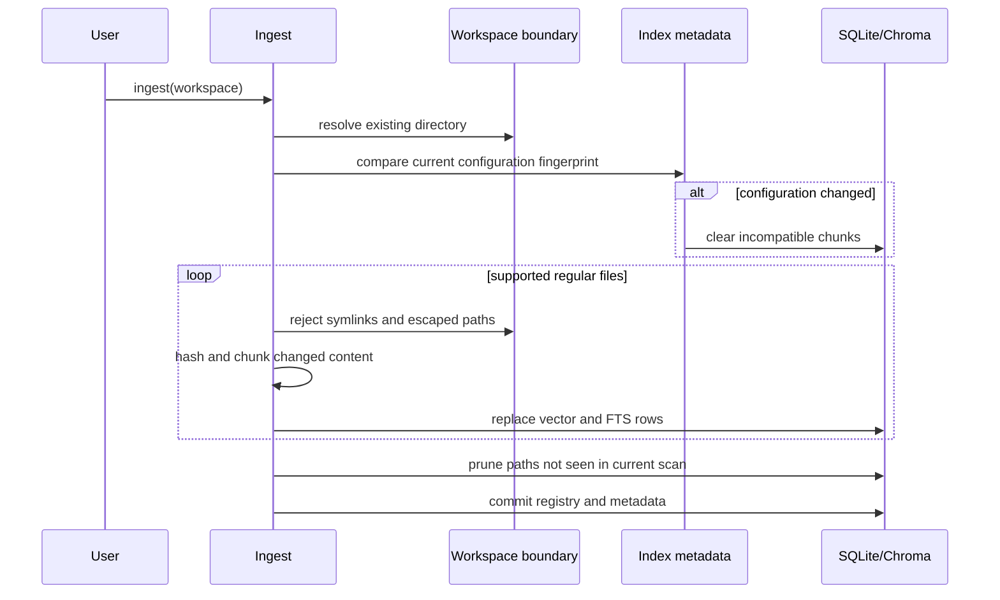

# Kinekt Architecture

This document describes the implemented Kinekt architecture. It supersedes the original design PDF where the
two disagree; the PDF remains as historical planning context.

## System Context

Kinekt is a context engine, not a coding agent. The core workflow is workspace ingestion, persisted local
retrieval, and context delivery through CLI or MCP boundaries.

## Module Boundaries

| Concern | Primary modules | Responsibility |
| --- | --- | --- |
| CLI transport | `cli.py` | Argument parsing, user-facing output, normalized command failures |
| MCP transport | `mcp_server.py` | FastMCP tool registration, workspace authorization, stable tool payloads |
| Workspace trust | `workspace.py`, `tools.py` | Canonical roots, path containment, safe reads, read-only git context |
| Workspace discovery | `workspace_discovery.py` | Git/project-root detection, explicit attachment metadata, Docker path aliases |
| Agent onboarding | `agent_setup.py` | Reviewed native or Docker stdio configuration for supported MCP clients |
| Ingestion | `ingest.py`, `chunking.py` | Ignore rules, file hashing, structural chunks, stale-file pruning |
| Index contract | `index_state.py` | Backend/model/dimension/chunker fingerprint and rebuild decisions |
| Retrieval | `query.py`, `vector_store.py` | FTS5 lexical search, vector similarity, path/symbol/source scoring |
| Persistence | `storage.py`, `schema.py` | SQLite connections, migrations, schema validation, concurrency pragmas |
| Sessions | `agent_core.py`, `session_store.py` | Incremental deterministic summaries, recent bounded history, retrieval-query construction, message persistence |
| Local models | `embeddings.py`, `generation.py` | Deterministic baseline and loopback-only Ollama adapters |
| Evaluation | `evaluation.py` | Recall@k, MRR, nDCG, latency, and repeatable case reporting |

## Ingestion And Index Lifecycle

The persisted fingerprint covers vector backend, embedding backend/model/dimension, and chunker version.
Explicitly configured backends fail with recovery guidance rather than silently mixing persisted vector formats.

## Retrieval

SQLite is the deterministic default. Each query combines:

1. Vector similarity from deterministic or explicitly configured Ollama embeddings.
2. SQLite FTS5 lexical rank.
3. File-path matches.
4. Symbol-name matches.
5. An inspectable source-location prior.

Results are diversified to one top chunk per file and contain file, symbol, start line, end line, component
scores, and a ranking explanation. `kinekt query --explain` exposes the score breakdown.

Retrieval changes are gated by repository-specific and pinned external evaluations described in
[Retrieval Evaluation](retrieval-evaluation.md).

## Session Compaction

Before each stateful agent turn, Kinekt compacts messages older than the bounded recent window. Only messages after
the summary's persisted sequence cursor are processed, each message contribution is capped at 240 characters, and
the stored summary is capped at 4,000 characters. Repeating compaction without new eligible messages is idempotent.
Retrieval and generation receive the summary plus recent raw turns, and the agent result exposes the exact summary
and retrieval query used as provenance.

## Trust Boundaries

- CLI workspaces must already exist.
- File reads resolve the final target and reject paths outside the workspace.
- Ingestion does not follow directory or file symlinks.
- MCP defaults to the server working directory and accepts additional roots only through explicit startup
  configuration.
- Repository discovery is read-only; attachment requires a human CLI confirmation or explicit `--yes`.
- Attachment metadata cannot authorize MCP access. The server still enforces its canonical allowed roots.
- Models can inspect `workspace_status` but cannot confirm or expand their own workspace access.
- Git status runs with optional locks disabled and a bounded timeout.
- Ollama endpoints must use loopback hosts.
- Read-only query/history/diagnostic paths do not initialize missing databases.
- User-controlled limits and text sizes are bounded.

## Storage

Each workspace owns `.kinekt/kinekt.sqlite3`. Schema version 4 contains:

- `sessions`
- `thread_messages`
- `session_summaries`
- `file_registry`
- `developer_profile`
- `code_chunks`
- `notes_chunks`
- `index_metadata`
- `chunks_fts` (FTS5 virtual table)

The sibling `.kinekt/workspace.json` file is versioned attachment metadata, not part of the SQLite schema and not
an authorization source. It records the confirmed root and optional host/container aliases for onboarding.

Write connections enable foreign keys, a five-second busy timeout, and WAL. Connections are closed at CLI and
MCP boundaries.

## Deployment

The base Python package has no mandatory runtime dependency. MCP and Chroma remain optional extras. Chroma is used
only through an embedded workspace-local `PersistentClient`; Kinekt does not start its network server. The
production container intentionally includes MCP and git because those are part of the documented container
experience. The image installs a built wheel and runs as a configurable non-root UID/GID. A committed `uv.lock`
drives supported-platform resolution in development, Docker, and CI; strict lock checks reject metadata drift.
